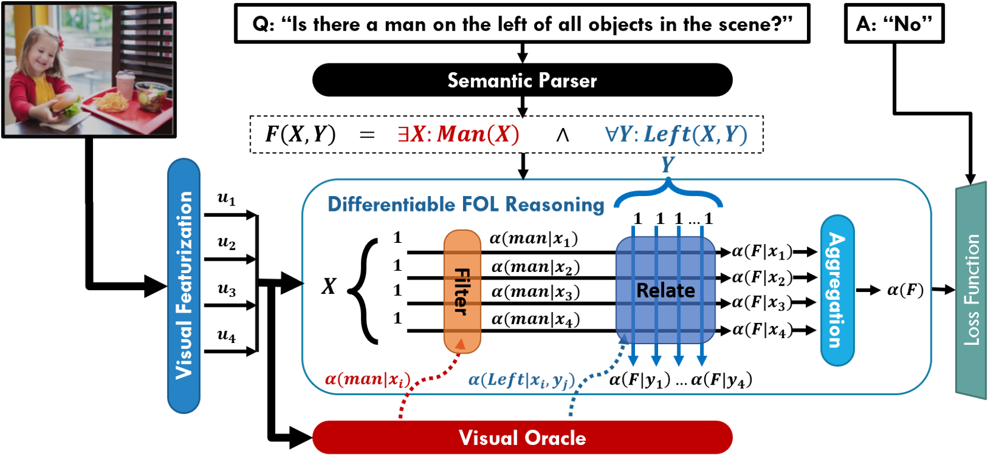

# Differentiable First Order Logic Reasoning for Visual Question Answering

The differentiable first order logic reasoning framework (termed as **&#8711;-FOL**) is a neuro-symbolic architecture for visual question answering (VQA) built upon formulating questions about visual scenes as first-order logic (FOL) formulas. 



For more technical details, please refer to our paper:

**Saeed Amizadeh, Hamid Palangi, Alex Polozov, Yichen Huang and Kazuhito Koishida, *Neuro-Symbolic Visual Reasoning: Disentangling “Visual” from “Reasoning”*, In Proceedings of the 37th International Conference on Machine Learning (ICML), pp. 10696--10707, Vienna, Austria, 2020. [[PDF]](https://proceedings.icml.cc/static/paper_files/icml/2020/6156-Paper.pdf) [[Supplement]](https://proceedings.icml.cc/static/paper_files/icml/2020/6156-Supplemental.pdf) [[Video]](https://icml.cc/virtual/2020/poster/6760) [[Slides]](https://icml.cc/media/Slides/icml/2020/virtual(no-parent)-15-19-00UTC-6760-neuro-symbolic_.pdf) [[bib]](https://proceedings.icml.cc/static/paper_files/icml/2020/6156-Bibtex.bib)**

If you are using this code for any research/publication purposes, please make sure to cite our paper:

```
@incollection{dfol_vqa_icml2020,
  author = {Amizadeh, Saeed and Palangi, Hamid and Polozov, Oleksandr and Huang, Yichen and Koishida, Kazuhito},
  booktitle = {Proceedings of the 37th International Conference on Machine Learning ({ICML-2020})},
  pages = {10696--10707},
  title = {Neuro-Symbolic Visual Reasoning: Disentangling ``Visual'' from ``Reasoning''},
  year = {2020}
}
```

# Setup

## Prerequisites

* Python 3.6 or higher.
* PyTorch 1.3.0 or higher.

After installing the prerequisites, run:

`> python setup.py install`

# Data Preparation and Model Configuration

## Getting the Data

Download the [GQA dataset](https://cs.stanford.edu/people/dorarad/gqa/download.html).\
Download the [GloVe word-embedding 42B-300d](http://nlp.stanford.edu/data/glove.42B.300d.zip).

## Preprocessing the GQA Question JSON Files 

In this project, in order to efficiently process the GQA questions, we use our own JSON format to represent the GQA questions. For increasing the data loading efficiency even further, our pipeline also accepts the question files in the HDF5 binary format. The latter is strongly recommended when training on large scale data. In order to convert the original GQA question files into our JSON and binary formats, one needs to run the following: 

`> cd DFOL-VQA/src`\
`> python gqa_preprocess.py path/to/gqa_question_json output/path -b -g`

Here the **-b** option makes sure to create the binary HDF5 files in addition to the pre-processed JSON files. The **-g** option drops the "global" type questions from the outputted files as we currently do not support encoding the global questions in our code base. Note that in the output directory, the questions are put in separate files based on their type. This is merely for more efficient data loading. One can furthermore segragate the questions based on the number of hops in their corresponding programs by deploying the **-l** option. This is especially useful when for example one is implementing a curriculum training strategy where each curriculum contains questions of a certain length.

For example to generate the train split, the following command must be run:

`> python gqa_preprocess.py .../GQA/questions1.2/train_all_questions .../GQA/p_train_all_questions/p_train_all_questions.json -b -g`

The output preprocessed files appear in a sub-directory with the same name as the input file except that it is prefixed by 'p_'. 
Since the **-b** option is deployed, the preprocessed data is also generated in the HDF5 format (the corresponding sub-directory is prefixed by 'h5_').\
**Note that the training config file needs to point to 'h5_' directories for efficient data loading.**

## Preparing the Config YAML

The config YAML file contains all the hyper-parameters and global variables required for training/testing a **&#8711;-FOL** model and should be prepared beforehand as such. A sample config file is provided [here](https://github.com/microsoft/DFOL-VQA/blob/main/config/sample_config.yaml). For the complete list of hyper-parameters and their descriptions, please see [here](https://github.com/microsoft/DFOL-VQA/blob/main/CONFIG_YAML.md).

# Running the **&#8711;-FOL** Framework

## Training

Once the config YAML is ready, the training loop can be started by running:

`> cd DFOL-VQA/src`\
`> python gqa_interpreter_experiments.py path/to/config/yaml -s 0`

The **-s** option specifies the random seed. The model parameters are initialized by random values unless the **-l** option is deployed. In particular, the **-l last** option initializes the weights from the latest saved checkpoint, while **-l best** option initializes the weights from the bast saved checkpoint (measured based on the validation accuracy). e.g.

`> python gqa_interpreter_experiments.py path/to/config/yaml -s 0 -l last`

Once the training is over, the test loop is performed on the specified test split.

### Curriculum Training

In order to replicate the trained models reported in the paper, we recommend adopting the curriculum training strategy we have used to train our models. The basic philosophy behind this strategy is since it is a challenging optimization task to train a &#8711;-FOL model from scratch over the entire GQA dataset, one should start the training with simpler questions (i.e. shorter and/or binary questions) and gradually add harder ones (i.e. longer and/or open questions) to the training dataset over a course of multiple curriculums. In doing so, one initiates the model weights at the begining of each curriculum with the weights of the best model (with lowest validation error) from the previous curriculum. This can be done by first duplicating the model checkpoints from the previous curriculum, renaming the duplicate directory to the current curriculum checkpoint and finally deploying the **-l best** option when running the training for the current curriculum.

Before starting the curriculum training, you need to divide the preprocessed *Train-All* and *Train-Balanced* datasets based on the question length. This can be achieved by deploying the **-l** option in the preprocessing script:

`> python gqa_preprocess.py .../GQA/questions1.2/train_balanced_questions .../GQA/p_train_balanced_questions/p_train_balanced_questions.json -b -g -l`\
`> python gqa_preprocess.py .../GQA/questions1.2/train_all_questions .../GQA/p_train_all_questions/p_train_all_questions.json -b -g -l`

The length-segregated subsets' filenames are suffixed by the length of the questions in that subset (e.g. "p_train_all_question_exist_1.h5" would refer to all questions of length 1 from *Train-All* set that end with the *exist* operator). Once both length-segregated and the original *Train-All* and *Train-Balanced* datasets are ready, we perform the curriculum training as follows:

- **Curriculum 0**: Train a randomly-initialized model on the {*exist*} subset of questions with length 1 from the *Train-All* set [See Cur 0 [config file](https://github.com/microsoft/DFOL-VQA/blob/main/config/curriculum_training/cur0_classifier-direct-ll-experiment_linux.yaml)].
- **Curriculum 1**: Train a model initialized by the best model from curriculum 0 on the {*exist*, *verfiy_attrs*, *query_attr*, *choose_attr*} subsets of questions with length 1 from the *Train-All* set [See Cur 1 [config file](https://github.com/microsoft/DFOL-VQA/blob/main/config/curriculum_training/cur1_classifier-direct-ll-experiment_linux.yaml)].
- **Curriculum 2**: Train a model initialized by the best model from curriculum 1 on the {*exist*, *verfiy_attrs*, *query_attr*, *choose_attr*, *choose_rel*, *verify_rel*, *and*, *or*, *two_different*, *two_same*} subsets of questions with length 1 from the *Train-All* set [See Cur 2 [config file](https://github.com/microsoft/DFOL-VQA/blob/main/config/curriculum_training/cur2_classifier-direct-ll-experiment_linux.yaml)].
- **Curriculum 3**: Fine-tune a model initialized by the best model from curriculum 2 on the {*exist*, *verfiy_attrs*, *query_attr*, *choose_attr*, *choose_rel*, *verify_rel*, *and*, *or*, *two_different*, *two_same*, *compare*, *all_same*, *all_different*} subsets of questions with length 1 from the *Train-Balanced* set [See Cur 3 [config file](https://github.com/microsoft/DFOL-VQA/blob/main/config/curriculum_training/cur3_classifier-direct-ll-experiment_linux.yaml)].
- **Curriculum 4**: Train a model initialized by the best model from curriculum 3 on *all* questions in the *Train-All* set (all terminal operators and all lengths) [See Cur 4 [config file](https://github.com/microsoft/DFOL-VQA/blob/main/config/curriculum_training/cur4_classifier-direct-ll-experiment_linux.yaml)].
- **Curriculum 5**: Fine-tune a model initialized by the best model from curriculum 4 on *all* questions in the *Train-Balanced* set (all terminal operators and all lengths). By the end of this curriculum, we have our final model *without* attention calibration model [See Cur 5 [config file](https://github.com/microsoft/DFOL-VQA/blob/main/config/curriculum_training/cur5_classifier-direct-ll-experiment_linux.yaml)].
- **Curriculum 6 (Calibration)**: Train a randomly-initialized calibrator model on the top of the best model from curriculum 5 on *all* questions in the *Train-All* set (all terminal operators and all lengths). [See Cur 6 [config file](https://github.com/microsoft/DFOL-VQA/blob/main/config/curriculum_training/cur6_classifier-direct-ll-experiment_linux.yaml)].
- **Curriculum 7 (Calibration)**: Fine-tune the best calibrator model from curriculum 6 on the top of the best model from curriculum 5 on *all* questions in the *Train-Balanced* set (all terminal operators and all lengths). [See Cur 7 [config file](https://github.com/microsoft/DFOL-VQA/blob/main/config/curriculum_training/cur7_classifier-direct-ll-experiment_linux.yaml)].

Notes:

- The training curriculums are on the *Train-All* set while the fine-tuning curriculums (with smaller learning rate) are on the *Train-Balanced* set.
- During Curriculums 0-5, we train the visual oracle of the &#8711;-FOL model, while in Curriculums 6 & 7, we only train a calibrator model with the oracle weights frozen.

## Testing

The test loop can be invoked independept of training by deploying the **-t** option:

`> python gqa_interpreter_experiments.py path/to/config/yaml -s 0 -l best -t`

## Prediction

Furthermore, a trained model can be run to produce a prediction JSON file for the specified test split by deploying the **-p** option: 

`> python gqa_interpreter_experiments.py path/to/config/yaml -s 0 -l best -t -p`

## Visualization

**&#8711;-FOL** is an extremly interpretable VQA framework. The whole question answering process can be visualized hop-by-hop for the specified test split by deploying the **-v** option:

`> python gqa_interpreter_experiments.py path/to/config/yaml -s 0 -l best -t -v`

# Contributors

+ [Saeed Amizadeh](mailto:saamizad@microsoft.com), [Microsoft Applied Sciences Lab](https://www.microsoft.com/applied-sciences/).
+ [Alex Polozov](mailto:Alex.Polozov@microsoft.com), [Microsoft Research AI](https://www.microsoft.com/en-us/research/lab/microsoft-research-ai/).
+ [Hamid Palangi](mailto:hpalangi@microsoft.com), [Microsoft Research AI](https://www.microsoft.com/en-us/research/lab/microsoft-research-ai/).

# Contributing

This project welcomes contributions and suggestions.  Most contributions require you to agree to a
Contributor License Agreement (CLA) declaring that you have the right to, and actually do, grant us
the rights to use your contribution. For details, visit https://cla.opensource.microsoft.com.

When you submit a pull request, a CLA bot will automatically determine whether you need to provide
a CLA and decorate the PR appropriately (e.g., status check, comment). Simply follow the instructions
provided by the bot. You will only need to do this once across all repos using our CLA.

This project has adopted the [Microsoft Open Source Code of Conduct](https://opensource.microsoft.com/codeofconduct/).
For more information see the [Code of Conduct FAQ](https://opensource.microsoft.com/codeofconduct/faq/) or
contact [opencode@microsoft.com](mailto:opencode@microsoft.com) with any additional questions or comments.

# Trademarks 

This project may contain trademarks or logos for projects, products, or services. Authorized use of Microsoft trademarks or logos is subject to and must follow Microsoft's Trademark & Brand Guidelines. Use of Microsoft trademarks or logos in modified versions of this project must not cause confusion or imply Microsoft sponsorship. Any use of third-party trademarks or logos are subject to those third-party's policies.
